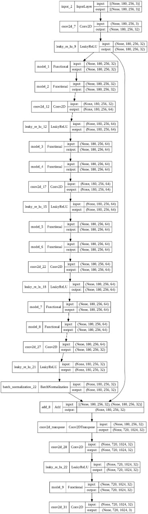
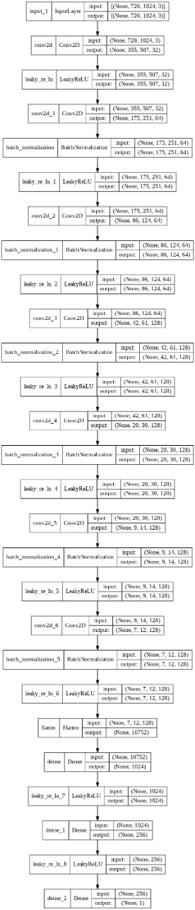

# Memory Lane - Backend

The main AI model of our project is an implementation of Generative Adversarial Network.

Generative Adversarial Networks, or GANs for short, are an approach to generative modeling using deep learning methods, such as convolutional neural networks.
The GAN architecture was first described in a paper by Ian Goodfellow, et al. titled “Generative Adversarial Networks.”

The GAN model architecture involves two sub-models: a generator model for generating new examples and a discriminator model for classifying whether generated examples are real, from the domain, or fake, generated by the generator model.

## Generator
Model that is used to generate new plausible examples from the problem domain.
###### Here is the architecture of our generator

 

## Discriminator
Model that is used to classify examples as real (from the domain) or fake (generated).
###### Here is the architecture of our discriminator

 
We have built and evolved our GAN to produce convincing results on astronomical images. A sample image restoration task is shown below -

## Dataset 
[images](https://esahubble.org/images/)

## Research Paper
[paper](https://arxiv.org/pdf/1609.04802.pdf)
